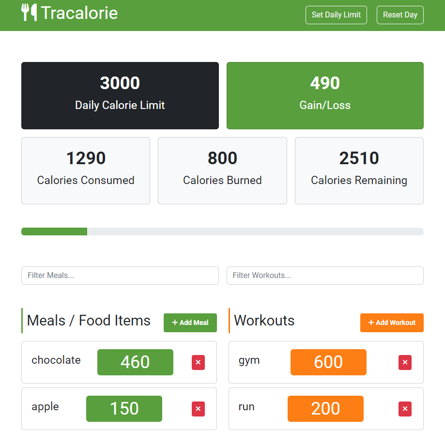

# Track Calorie Project

Welcome to the **Track Calorie Project**! 🎉 This project helps you monitor your daily calorie intake through a straightforward web application. Built using **vanilla JavaScript** and **classes**, this tool allows you to log meals, view calorie consumption, and manage your calorie limit.

## 🚀 Introduction

In a world where it’s easy to lose track of your calorie intake, the Track Calorie Project offers a simple yet effective solution. This application provides an easy-to-use interface to help you log your meals and track your daily calorie intake. The project showcases the use of JavaScript classes for managing application state and user interactions.

## 📸 Screenshots

*Example of the main interface for adding meals.*

## 🔧 Features

- **Add Meals:** Log meal details including name and calories.
- **Add Workouts:** Log workout details including name and calories.
- **View Daily Calorie Intake:** See a summary of total calories consumed for the day.
- **Manage Meals and Workouts:** Add or Delete entries.
- **Simple Interface:** Clean and user-friendly design for easy navigation.
- **Persistent Data:** Uses LocalStorage to retain meal data across sessions.

## 🛠️ Technologies Used

- **JavaScript (ES6+):** Main language for functionality and logic.
- **HTML5:** Structure and content of the application.
- **CSS/Bootstrap:** Basic styling for a clean and responsive design.
